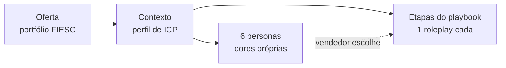

# FIESC — Plano B: multi-persona com dores e produtos por persona

Atualizado em 2026-09-23.

## Objetivo

Gerar um único roleplay da FIESC (modo playbook, em HML) com 6 personas, cada uma com 3 dores próprias ligadas a 3 produtos do portfólio, e o vendedor tendo de descobrir essas dores na call. Este é o plano B: usa só o que a Perfecting já oferece hoje, sem depender de mudança no backend.

- **Viável hoje:** personas distintas, cada uma com as próprias dores no prompt do comprador, escolhidas pelo vendedor antes da call.
- **Viável com ressalvas:** as dores serem reveladas só sob investigação, e os produtos aparecerem como o que o comprador conhece e usa.
- **Não existe hoje:** feedback que diga quantas dores da persona o vendedor descobriu.

Base: leitura do código do backend (branch `homolog`, `b417d02`, 2026-09-21) e do facility. Nada disto foi validado em call real ainda.

## Como a Perfecting organiza isso

Um rascunho vira uma oferta, um contexto e N personas; cada etapa do playbook vira um roleplay que aceita qualquer persona do contexto.



| Peça | Onde vive | Chega ao comprador na call? |
| --- | --- | --- |
| Oferta | Uma por contexto | Não. Serve para gerar conteúdo e para o feedback `offer_appropriateness` |
| Dores do contexto (`quantifiable_pain_points`) | Contexto | Não direto. Entram quando a persona é gerada |
| `persona_prompt` | Persona | Sim, na seção `Personalidade`, sem regra de revelação |
| Conhecimento por etapa (`content_step`) | Persona × etapa, gerado a partir do `persona_prompt` | Sim, em `# Conhecimento de Background`, com regra de só revelar se perguntado |
| Objeções | Etapa ou persona | Sim, até 3, com critério de ceder nunca dito em voz alta |

Duas regras do prompt do comprador ajudam na descoberta: ele não confirma dor que não disse (corrige o vendedor que chuta), e o `# Conhecimento de Background` só é revelado sob pergunta pertinente (`../backend/src/application/engines/role_plays_sessions/prompt_builder/shared/sections.py`).

## Estratégia recomendada

A dor e o produto de cada persona entram pela instrução daquela persona, porque a oferta não chega ao comprador e o contexto é compartilhado por todas.

1. **Oferta = o portfólio.** `oferta_descricao` lista os produtos da FIESC que entram, do jeito que se apresentam ao mercado. Assim a geração de conteúdo e o feedback conhecem todos.
2. **Contexto no nível geral.** As dores do contexto descrevem o ICP da indústria catarinense, sem as 18 dores específicas. Se elas estiverem no contexto, vazam para todas as personas.
3. **Uma instrução por persona.** Cada persona recebe o próprio texto com cargo, empresa, 3 dores em camadas, a relação com os 3 produtos e as regras de revelação (modelo na próxima seção). No gerador de persona (`generate_persona_for_context.py`), `additional_instructions` tem prioridade alta e não pode ser contrariada.
4. **Uma chamada de geração por persona.** Em vez de um lote de 6 com a mesma instrução, 6 chamadas a `persona/generate_batch/sse` com `persona_quantity=1`, cada uma com a própria instrução. Roda antes da implementação do playbook, quando ainda não há roleplays no contexto, então cada chamada é rápida.
5. **Implementação sem persona fixa.** O playbook é implementado com `persona_id` nulo, como já validado na FIESC (contexto 35, 7 personas). O vendedor escolhe a persona antes da call.
6. **Contexto novo.** O contexto 35 ainda tem objeções antigas no nível do contexto; para iterar sem interferência, usar um contexto limpo.

Por que não um lote único: o `persona_count=6` de hoje manda a mesma instrução para as 6 gerações, e cada uma não sabe qual posição ocupa. Uma matriz "persona 1 tem A, B, C…" numa instrução só vira sorteio. O backend já aceita instrução por posição (`persona_specs`, em `app_workers/persona_batch_generation/_schemas.py`), mas só o chatbot da Perfecting usa; o endpoint HTTP não expõe.

## Modelo de instrução por persona

Cada instrução é escrita do lado do comprador e diz como cada dor é revelada; sem isso, a dor fica no `persona_prompt`, onde nada impede o comprador de soltá-la no início.

**Dores em camadas**, para separar vendedor bom de mediano:

| Camada | Quando aparece | Exemplo de gatilho |
| --- | --- | --- |
| Superficial | Se o assunto surgir | Pergunta geral sobre desafios da operação |
| Investigada | Só com pergunta específica | Pergunta sobre custo de afastamento ou turnover |
| Escondida | Só com confiança e investigação de impacto | Vendedor explorou consequências e quem mais sofre com o problema |

**Produtos do lado do comprador:** o que ele já ouviu falar, o que usa hoje (inclusive de concorrente) e o que não conhece. O comprador nunca "sabe" o portfólio; é o vendedor quem liga dor a produto.

Exemplo (valores ilustrativos, a substituir pelo material da FIESC):

```text
Gerente industrial de metalúrgica com 200 funcionários no Vale do Itajaí, 6 anos no cargo.

Dores (não fala delas por conta própria):
1. Superficial — turnover alto de operadores. Menciona se perguntarem sobre desafios da equipe.
2. Investigada — afastamentos por LER custando cerca de R$ 40 mil/mês. Só admite se o vendedor perguntar sobre saúde ou custo com afastamentos.
3. Escondida — adequação à NR-12 pendente com fiscalização prevista. Só conta se sentir confiança e o vendedor explorar riscos regulatórios.

Produtos:
- Já ouviu falar de [produto A], mas acha caro.
- Usa hoje [concorrente] para [necessidade do produto B] e está satisfeito em parte.
- Não conhece [produto C].

Nunca cite as três dores de uma vez. Não confirme dor que o vendedor sugerir sem ter perguntado.
```

As 6 personas devem variar em cargo, porte de empresa e setor, para que cada call explore um caminho diferente do portfólio.

## Mudanças na facility

Tudo fica na facility e é opcional: sem personas detalhadas, o envio continua igual ao de hoje.

| Parte | Mudança |
| --- | --- |
| `app/lib/types.ts` | `scenario.personas?: { nome?: string; instrucoes: string }[]`. Quando preenchido, substitui `persona_count` e `persona_instructions` |
| Tela de Criação | Um card por persona para editar nome e instrução, com o modelo acima como ponto de partida |
| `supabase/functions/implement-playbook` | No estágio `personas`, uma chamada a `openPersonaBatchStream` por persona, em série, com `persona_quantity=1` e a instrução dela. Reconciliar por `listPersonasByContext` após cada uma, sem reabrir stream (retry duplicaria a persona) |
| `supabase/functions/process-import` (opcional) | Extrair do material da FIESC uma proposta de matriz persona × dores × produtos para revisão |
| Verificação pós-envio | Para cada persona, ler `GET /role_plays_session/role_play_prompt` de uma etapa e conferir `has_knowledge_blocks`, `has_objections` e se as dores aparecem em `# Conhecimento de Background` |

Tempo: o estágio de personas passa de 1 lote para 6 chamadas em série. Antes da implementação não há backfill de conteúdo, então cada uma é curta; o custo maior continua sendo a implementação, que gera conhecimento para 6 personas × cada etapa no worker do backend.

## Riscos e limites

O maior risco é a dor não chegar à seção com regra de revelação; o maior limite é o feedback não saber quais dores a persona tinha.

| Risco | Impacto | Mitigação no plano B |
| --- | --- | --- |
| IA dilui as dores no `persona_prompt` | Dores viram pano de fundo, sem números | Instrução curta e explícita; ler o `persona_prompt` gerado antes de implementar |
| Dor fica só em `Personalidade` | Comprador solta a dor no início | Regras de revelação na instrução; conferir `# Conhecimento de Background` |
| Conhecimento por etapa não distribui as 3 dores | Uma dor some em certas etapas | Conferir o prompt de cada etapa para uma persona antes de gerar as 6 |
| Objeções por persona anulam as da etapa | Objeções da FIESC não aparecem; limite de 3 | Aceitar as geradas por persona, ou escrever as objeções na instrução da persona |
| Voz sorteada por `generate_from_context` | Gênero da voz pode não bater em agentes antigos | Sem impacto em HML; em PROD só após sondar os agentes |
| Call curta para 3 dores | Vendedor descobre 1 ou 2 por call | É desejável para iterar: cada call explora um caminho |

**O que não existe hoje:**

- **Feedback por dor.** As rubricas são da etapa, genéricas; não há "você descobriu 2 de 3 dores". Precisaria de rubrica por persona no backend.
- **Checklist confiável.** A auditoria de 2026-09-13 mostrou que o checklist aceita fala do comprador como se fosse do vendedor.
- **Oferta no prompt do comprador** e vínculo oferta ↔ persona ou dor. O `offer_appropriateness` avalia contra o portfólio inteiro, sem saber a etapa.

## Validação e critérios de sucesso

Validar com uma persona antes de gerar as seis: o teste leva minutos e decide se o formato da instrução serve.

- [ ] Gerar 1 persona em HML, num contexto de teste, com `persona_quantity=1` e a instrução do modelo
- [ ] Ler o `persona_prompt`: as 3 dores estão explícitas, com os números, e as regras de revelação foram mantidas
- [ ] Implementar o playbook e ler o `role_play_prompt` de 2 etapas: dores em `# Conhecimento de Background`, `has_objections` verdadeiro
- [ ] Fazer 2 calls de teste: uma sem investigar (o comprador não deve soltar as dores) e uma investigando (as dores devem aparecer)
- [ ] Se passar, gerar as outras 5 personas e repetir a leitura para uma etapa de cada

**Sucesso:** as 6 personas são distintas, cada uma com as próprias 3 dores no prompt, a dor escondida só aparece sob investigação, e nenhuma persona cita produto que não está na instrução dela.

**Se falhar:** dores diluídas pedem ajuste do texto da instrução; dores fora do `# Conhecimento de Background` ou objeções anuladas pedem mudança no backend, que é o plano A.
